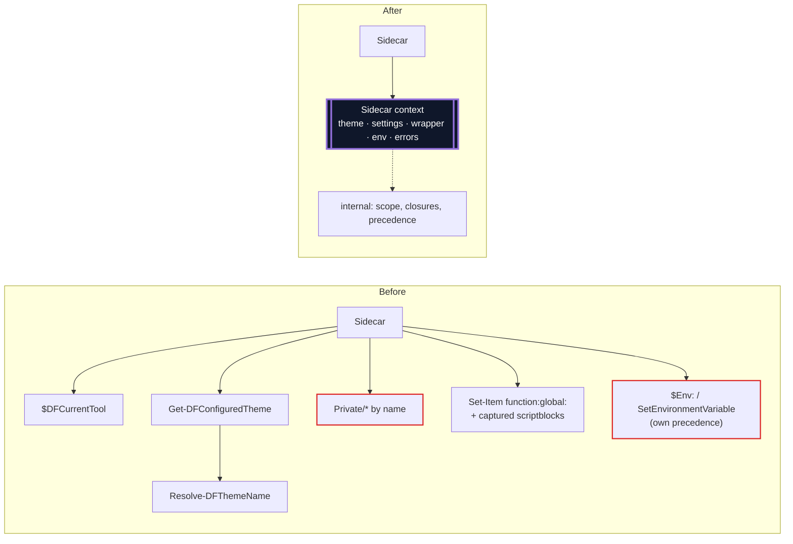
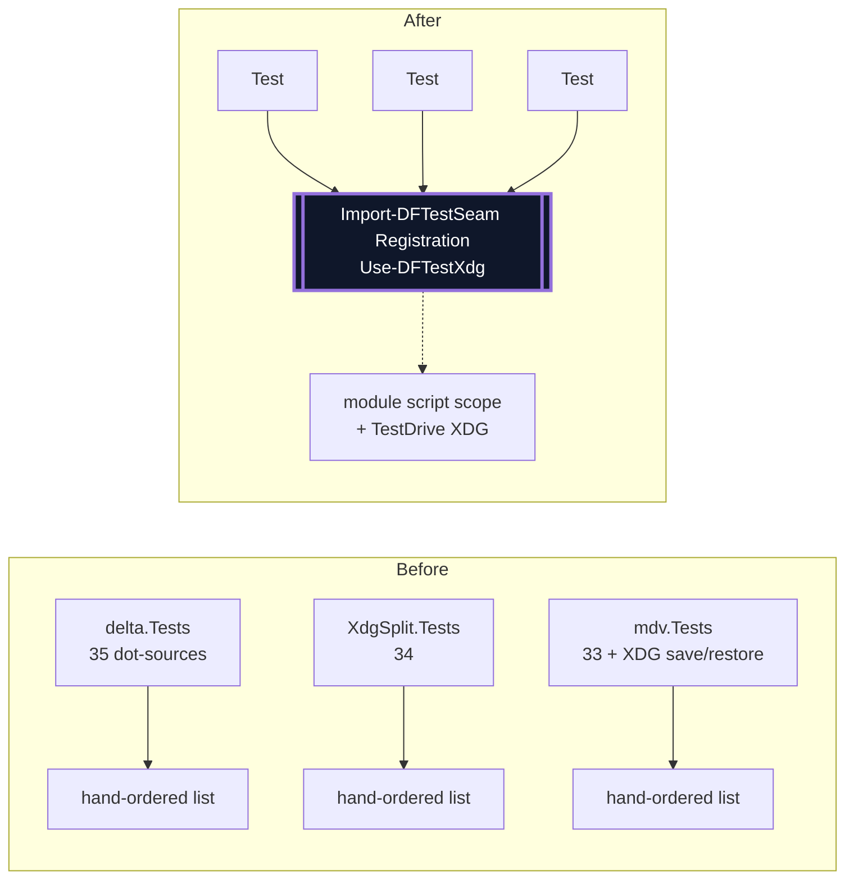
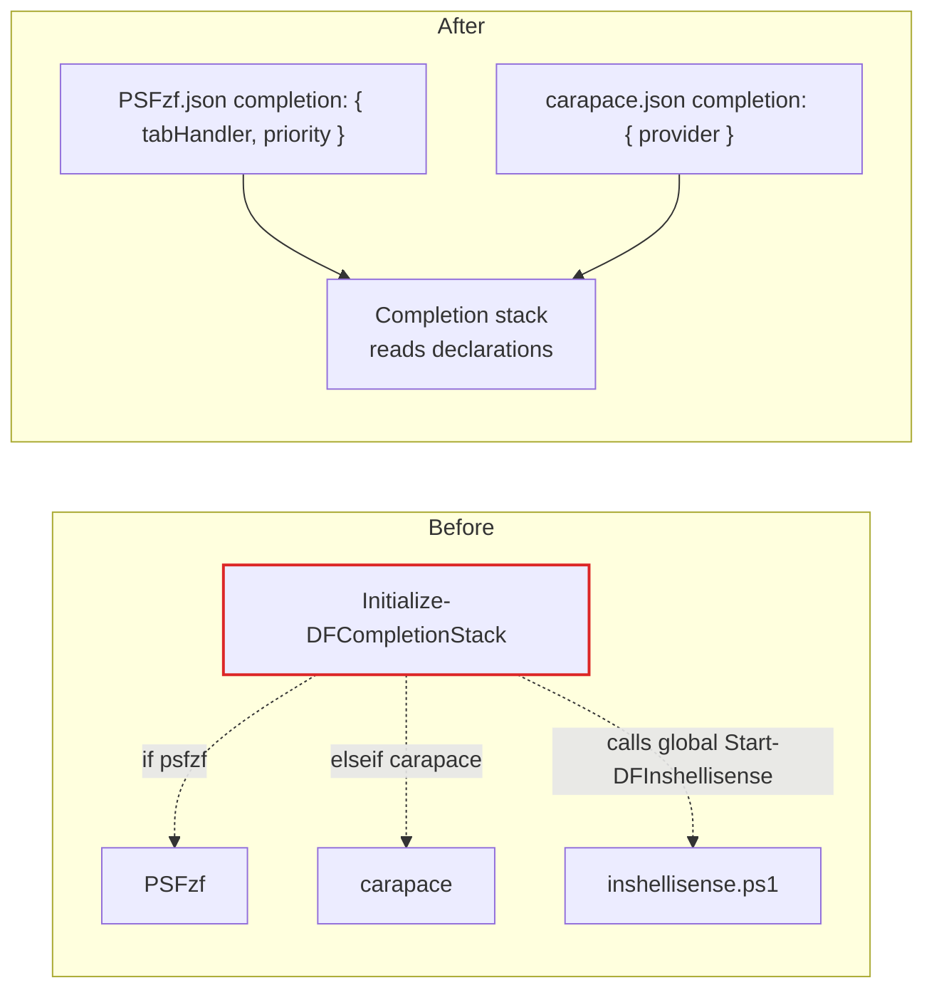
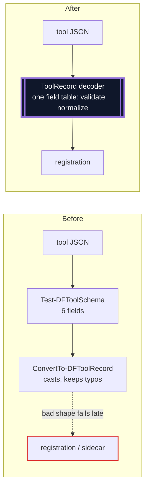
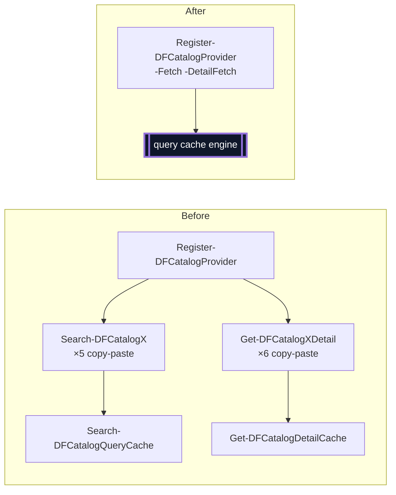
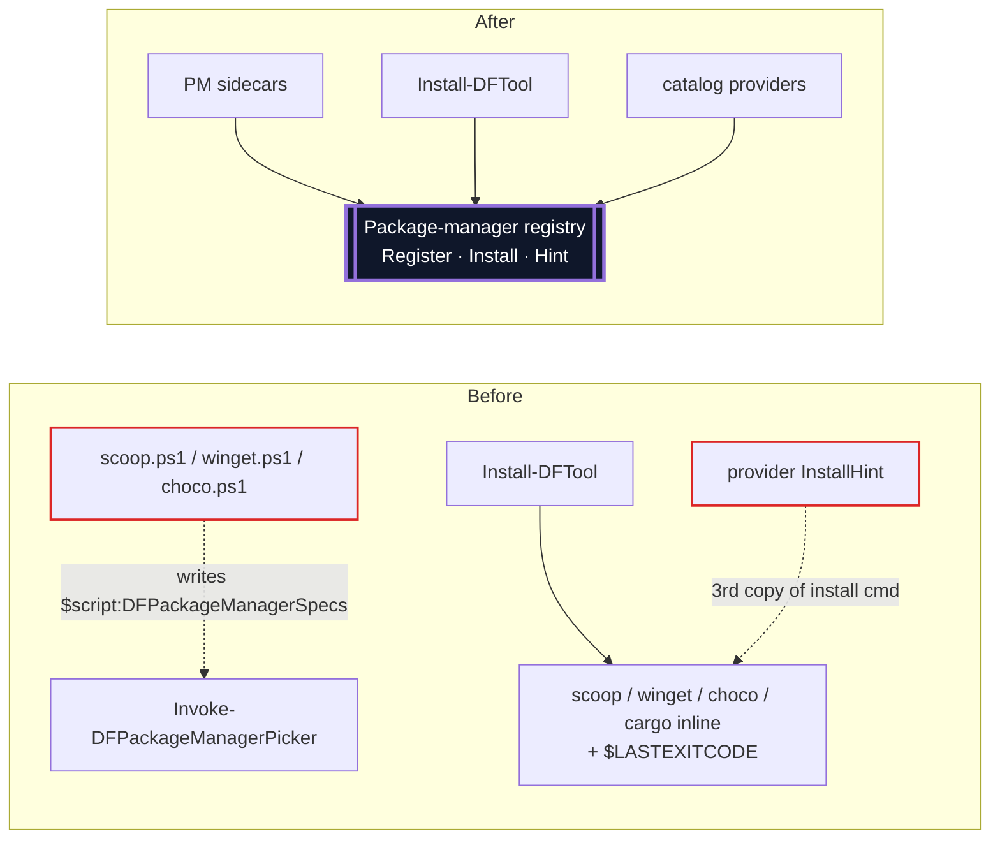
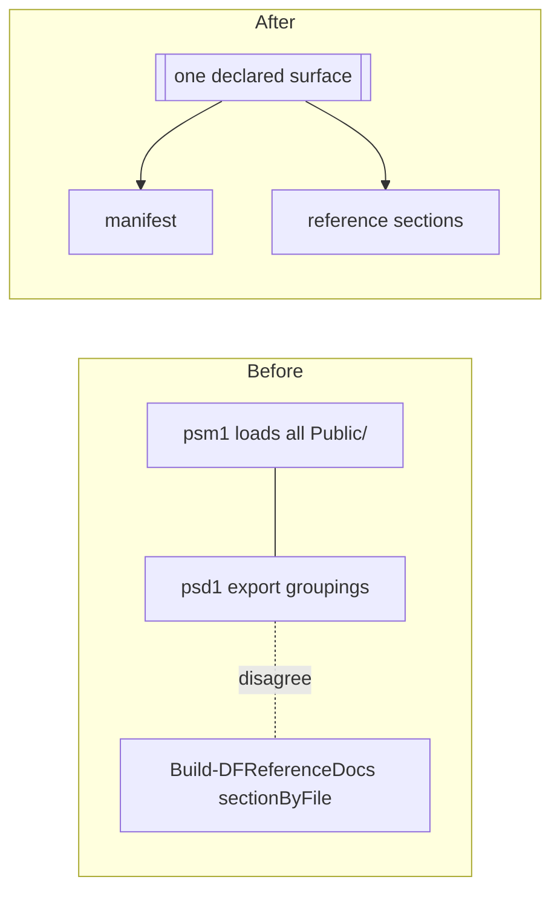

# DotForge Architecture Review (Claude)

**Date:** 2026-10-06
**Scope:** tool registration and the sidecar seam, the package catalog, caching, install, the Pester harness, and build metadata. Read-only; no production code changed.

**Status (2026-10-08):** Triaged. Adopted: #1 (scoped down to a package-manager→catalog alias on the provider record), #3, #4, #5, #6 (lighter: unknown-field warnings plus shape checks), #9 (as a consistency test only), and the smaller findings as one sweep. Shrunk: #2, to a shared theme helper plus one env-precedence rule; the full context object is deferred. Deferred: #8 (until `Install-DFTool` next changes). Skipped: #7, because the wrappers carry help that the docs tests parse.

**Legend:** solid box = module · dashed edge = seam · red = leak across a seam · thick dark box = deep module.

No `CONTEXT.md` or `docs/adr/` exists, so no candidate conflicts with a recorded decision. The earlier `arch-imp-audit.md` from today was cross-checked. Its five candidates appear below (#2, #4, #6, #9, plus the exe wrapper folded into #2), with fresh evidence and four new ones.

## Already deep

- **Path normalization** (`ConvertTo-DFPath`): one interface hides every Windows/XDG path rule.
- **The catalog cache engine** (`Invoke-DFCacheFirst`, `Private/DFCatalog.ps1:170-233`) handles fresh results, serving stale data, a stale cache counting as a miss, fetch-failure fallback and skip-empty, all behind one call.
- **The companion runner** (`Invoke-DFToolCompanion`) hides PowerShell's dot-source scope rules and checks that a hook comes from the right file (`:79-80`).
- **Role winner selection** (`Get-DFRoleWinners`, `Set-DFRoleEnv`) and **release data** (`DFReleaseData.ps1`): `Update-DFCategoryDb` and `Update-DFToolIdentityGuide` are each one-line callers of it.

---

## 1. Catalog identity module: one name per catalog

**Strength:** Strong · **Dependency category:** in-process
**Files:** `Private/DFCatalog.Base.ps1`, `Private/DFCatalog.Crates.ps1`, `Private/DFCatalog.PSGallery.ps1`, `Private/Get-DFToolIdentityGuide.ps1`, `Private/Get-DFCatalogInstalled.ps1`, `Private/Resolve-DFToolIdentityLinkage.ps1`, `Private/Get-DFCatalogLocalPackages.ps1`, `Public/Find-DFPackage.ps1`, `Public/Install-DFTool.ps1`, `Tools/{mdcat,mdv,posh-git,PSFzf,Terminal-Icons}.json`, `data/tool-identities.json`

```mermaid
flowchart LR
  subgraph Before
    TJ["Tools/*.json<br/>cargo / psresource"] --> IG[Identity guide<br/>key cargo:mdcat]
    PR["Catalog providers<br/>crates / psgallery"] --> K[Get-DFIdentityKeys<br/>key crates:mdcat]
    IG -. no match .-> K
    FP[Find-DFPackage<br/>scoop bucket strip] -.dup.-> K
    LP[Get-DFCatalogLocalPackages] -.reads scoop/index.json<br/>winget/index.db.-> PR
    classDef leak stroke:#dc2626,stroke-width:2px,color:#dc2626;
    class FP,LP leak
  end
  subgraph After
    TJ2[Tools/*.json] --> CI[[Catalog identity module<br/>canonical name · aliases · key normalization · local listing]]
    PR2[Catalog providers] --> CI
    IG2[Identity guide] --> CI
    FP2[Find-DFPackage] --> CI
    classDef deep fill:#0f172a,color:#fff,stroke-width:3px;
    class CI deep
  end
```

**Problem.** There is a live bug. Tool records and `data/tool-identities.json` key packages as `cargo`/`psresource`, but the providers register as `crates`/`psgallery`, and nothing maps one name to the other. As a result, identity keys never match: `Resolve-DFToolIdentityLinkage` hands `cargo` to a catalog that doesn't exist. Five tools can never be corroborated. Key-normalization knowledge is spread across `DFCatalog.Base.ps1:105` and `Find-DFPackage.ps1:150`. `Get-DFCatalogLocalPackages.ps1:35-43` reads two providers' index files directly, bypassing the provider seam.

**Solution.** One module owns catalog identity: the canonical catalog name, accepted aliases, `source:id` key normalization (including the scoop bucket strip), and a "list local packages" hook on the provider interface.

**Wins**
- Fixes cargo/psresource matching
- Locality: key rules live in one place
- Provider seam stops leaking index files
- Tests cover key matching in one place

---

## 2. Sidecar context module

**Strength:** Strong · **Dependency category:** in-process
**Files:** `Private/Invoke-DFToolCompanion.ps1`, `Private/Get-DFConfiguredTheme.ps1`, `Private/Resolve-DFThemeName.ps1`, `Tools/{bat,delta,fzf,glow,mdcat,moor,psreadline,vivid,fastfetch}.ps1`, `Tools/mdv.setup.ps1`

Mass diagram: how wide the interface a sidecar author must learn is (`█`) compared with what core does for them (`░`).

```text
Before  interface ████████████████████████  ambient $DFCurrentTool, all of Private/, hook naming,
        impl      ██████████░░░░░░          captured-scriptblock idiom, 3 env precedence policies,
                                            theme chain, settings reads, wrapper closures
After   interface ████                      $ctx.Theme() · $ctx.Setting() · $ctx.Wrap() · $ctx.SetEnv()
        impl      ░░░░░░░░░░░░░░░░░░░░░░░░  resolution, precedence, closures, error isolation
```



**Problem.** The sidecar interface is all of `Private/` plus ambient scope.
- The theme chain `Get-DFConfiguredTheme`→`Resolve-DFThemeName` is copied in all 9 files that resolve a theme.
- An identical `ExpectingInput` exe wrapper appears in `glow.ps1:113-117` and `fastfetch.ps1:51-55`.
- The captured-scriptblock idiom appears 5 times.
- Env writes follow three precedence policies: `xdg.vars` keep an existing value, the `env` block overwrites, and each sidecar picks its own.
- The sidecar body runs outside try/catch (`Invoke-DFToolCompanion.ps1:69`), so a single throw aborts registration of every tool after it.

**Solution.** Pass the sidecar one context object that carries theme, settings, wrapper creation and env writes under a single precedence rule. Wrap the body in the same error isolation hooks and setup already get. Existing sidecars keep working while they migrate one at a time.

**Wins**
- Theme chain: 9 copies → 1
- One env precedence rule
- One sidecar failure stops aborting the rest
- Private renames stop breaking plugins
- Leverage: every new tool benefits

---

## 3. Fingerprint cache module

**Strength:** Strong · **Dependency category:** local-substitutable (TestDrive)
**Files:** `Private/Get-DFCachedCommandOutput.ps1`, `Private/Get-DFHelpTopicList.ps1`, `Private/Resolve-DFCliHelpFlag.ps1`, `Private/DFCatalog.Scoop.ps1`, `Private/DFCatalog.Winget.ps1`, `Tools/vivid.ps1`, `Private/Write-DFFileAtomic.ps1`, `Public/Update-DFPackageCache.ps1`, `Private/Get-DFCatalogLocalPackages.ps1`

Cross-section: the same job done by separate hand-rolled caches.

| Module | Fingerprint | Atomic write |
|---|---|---|
| catalog envelope | TTL | yes |
| scoop index | git HEAD `.key` | **`.key` no** |
| winget index | msix size + mtime | **meta no** |
| `Get-DFCachedCommandOutput` | exe path + mtime | **no** |
| `Get-DFHelpTopicList` | module list | **no** |
| `Resolve-DFCliHelpFlag` | none | **no** |
| `Tools/vivid.ps1` | theme name | **no** |

```mermaid
flowchart LR
  subgraph Before
    A[scoop] --> F1[(txt + .key)]
    B[help topics] --> F2[(txt + .key)]
    C[cached cmd output] --> F3[(txt + .key)]
    D[vivid] --> F4[(txt + .key)]
    U[Update-DFPackageCache] -.parses seen-queries.json<br/>walks provider/details.-> X[(catalog cache layout)]
    classDef leak stroke:#dc2626,stroke-width:2px;
    class U leak
  end
  subgraph After
    A2[scoop] & B2[help topics] & C2[cmd output] & D2[vivid] --> FC[[Fingerprint cache<br/>Get · Set · fingerprint scriptblock<br/>atomic, XDG-rooted]]
    classDef deep fill:#0f172a,color:#fff,stroke-width:3px;
    class FC deep
  end
```

**Problem.** The "text plus `.key` fingerprint" cache is written four times. Five writers aren't atomic, even though `Write-DFFileAtomic` says it covers "every cache and state file". Four modules build `Join-Path (Get-DFXdgPath Cache) 'dotforge'` themselves. Knowledge of the cache layout leaks into `Update-DFPackageCache.ps1:75-104` and `Get-DFCatalogLocalPackages.ps1:46`.

**Solution.** One fingerprint-cache module. Callers pass a name, a fingerprint scriptblock and a producer, and get content back. The module owns the path, staleness checks and atomic writes. The catalog cache exposes enumeration operations so its layout stays inside it.

**Wins**
- 4 cache implementations → 1
- Every cache write becomes atomic
- Cache layout stays inside the module
- One module to test against TestDrive

---

## 4. Test composition harness

**Strength:** Strong · **Dependency category:** in-process
**Files:** `tests/TestSupport.ps1`, `tests/*.Tests.ps1` (111 of 126), `tests/ModuleState.Tests.ps1`



**Problem.**
- 111 test files dot-source hand-ordered load lists; `delta.Tests.ps1:2-35` alone is 35 files.
- `ModuleState.Tests.ps1:2-4` acknowledges that dot-sourcing doesn't reproduce the module's shared script scope.
- 46 files hand-roll the XDG save / point at TestDrive / restore sequence (82 assignments).
- The 87 `Get-Command` mocks show that "is this tool on PATH?" has no DotForge-owned seam.
- `TestSupport.ps1` has a single helper.

**Solution.** Add two test-only modules. `Import-DFTestSeam` loads the real module, or a named seam with its dependencies. `Use-DFTestXdg` isolates all four `XDG_*_HOME` variables and restores them automatically. Keep a few true `Import-Module` contract tests.

**Wins**
- Load lists: 111 → 0
- XDG isolation can't be forgotten
- Tests run in real module scope
- Leverage: a loader change fixes all tests

---

## 5. Declared completion field (remove core's tool-name switch)

**Strength:** Worth exploring · **Dependency category:** in-process
**Files:** `Private/Initialize-DFCompletionStack.ps1`, `Tools/PSFzf.json`, `Tools/carapace.json`, `Tools/inshellisense.ps1`, `docs/plugin-architecture.md`



**Problem.** `Initialize-DFCompletionStack.ps1:114-118` branches on `psfzf` and `carapace` by name. It also calls a global that only one sidecar defines. That breaks the plugin invariant, and it's the only tool-name switch left in core.

**Solution.** Add a declarative `completion` field, or a `completion` role whose hook owns the Tab binding, and have core read only declarations.

**Wins**
- Removes the invariant violation
- New completer: no core edit
- Testable with fake tool records

---

## 6. ToolRecord decoder owns validation

**Strength:** Worth exploring · **Dependency category:** in-process
**Files:** `Private/Import-DFToolDb.ps1`, `Private/Test-DFToolSchema.ps1`, `Private/New-DFToolPickerFunction.ps1`, `Private/Register-DFToolAliases.ps1`, `Private/Resolve-DFThemeName.ps1`



**Problem.**
- `[bool]"false"` evaluates to `$true` for `prewarm`, `ansi` and `list_accepts_path` (`Import-DFToolDb.ps1:155,158,182`).
- The `picker`, `themeMap`, `aliases`, `env` and `dependsOn` shapes aren't checked.
- Misspelled fields are kept without a warning.
- A picker scriptblock with a syntax error only surfaces at profile load.
- Adding a field means editing the validator, the normalizer and the consumer, which share no field list.

**Solution.** One field table drives both validation and normalization. `settings` stays free-form.

**Wins**
- Errors surface at load, once
- One field table, three uses
- Negative tests in one place

---

## 7. Query-cache provider binding

**Strength:** Worth exploring · **Dependency category:** ports & adapters (7 adapters)
**Files:** `Private/DFCatalog.Base.ps1`, `Private/DFCatalog.{Choco,Npm,Pypi,Crates,PSGallery}.ps1`



**Problem.** Every query-cache adapter repeats two wrappers that only forward to the cache engine.

**Solution.** `Register-DFCatalogProvider` binds the fetch scriptblocks itself, so an adapter writes only its fetch and parse logic.

**Wins**
- Removes 11 forwarding wrappers
- New web catalog: fetch functions only

---

## 8. Package-manager registry

**Strength:** Worth exploring · **Dependency category:** ports & adapters
**Files:** `Public/Install-DFTool.ps1`, `Private/Resolve-DFPackageManager.ps1`, `Private/Invoke-DFPackageManagerPicker.ps1`, `Tools/{scoop,winget,choco}.ps1`, `Private/DFCatalog.{Scoop,Winget}.ps1`



**Problem.**
- Sidecars write a core private hashtable directly.
- Install command lines live in three places.
- `Install-DFTool` runs package managers inline and checks `$LASTEXITCODE`, with no seam.
- The `psresource` availability check is a special case.

**Solution.** Mirror `Register-DFCatalogProvider`: one registry with an install command per package manager, used by install, the catalog hints and the PM picker. Pairs naturally with #1.

**Wins**
- Install commands: 3 copies → 1
- Install becomes testable without running real package managers

---

## 9. Public-surface metadata

**Strength:** Speculative · **Dependency category:** in-process
**Files:** `DotForge.psd1`, `DotForge.psm1`, `build/Build-DFReferenceDocs.ps1`



**Problem.** The groupings already disagree: `Invoke-DFWithPager` and `Get-DFCommandConflict` fall into different sections in the manifest and the reference docs. Nothing checks `Public/` against `FunctionsToExport`.

**Solution.** Generate both from one source, but only once the manifest-generation work in `docs/plugin-architecture.md` lands. Until then, a test that the two groupings agree is enough.

**Wins**
- One fact, one place

---

## Smaller findings (not candidates)

- Dead `if (-not $cacheRoot)` checks: `Get-DFCatalogCacheRoot` always returns a path (8 sites).
- JSONC comment stripping is copied in 3 `build/` scripts and 1 test, and the heading-slug logic twice.
- `Resolve-DFCliHelpFlag` runs the help command and then throws the text away, so `Show-DFCliHelp` runs it again.
- Two different regexes colorize help headers (`DFHelpers.Help.ps1:40`, `Format-DFCliHelpText.ps1:29-43`).
- Stale comments say aliases are global and "ExportedAliases is empty" (`Get-DFCommandConflict.ps1:78-79`, `tests/Coreutils.Conflicts.Tests.ps1:33-34`).
- `Test-DFHasEntries` and `Get-DFRegistrationSet` fail the deletion test: each has one caller and is a one-liner.
- The setup-state path is built in two places (`Get-DFToolSetupState.ps1:22`, `Complete-DFToolSetup.ps1:57`).

## Top recommendation

**Start with [#1, the catalog identity module](#1-catalog-identity-module-one-name-per-catalog).** It's the only candidate fixing a live bug: five tools can't be identity-matched today. The change is small, and it creates the seam that #7 and #8 extend. **#2, the sidecar context module,** is the next pick and has the most leverage, because every new tool benefits.
