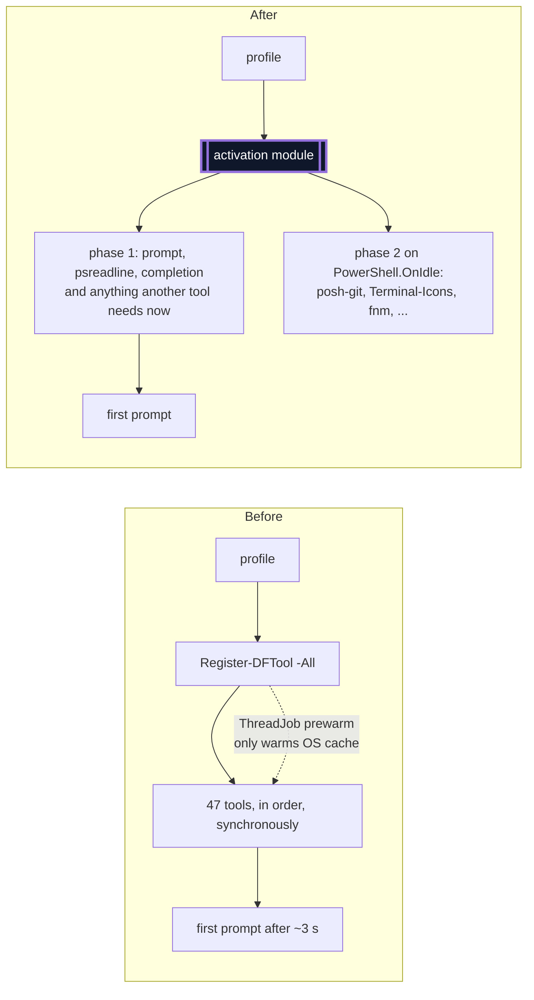
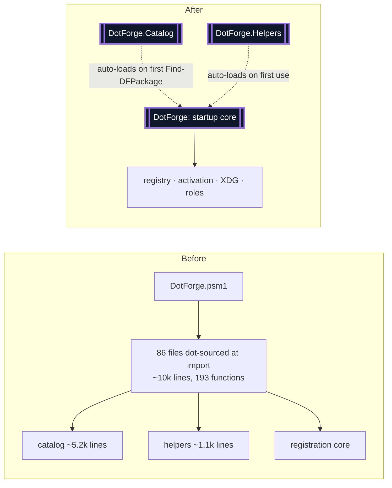
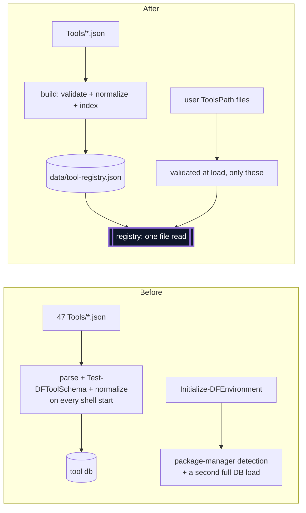
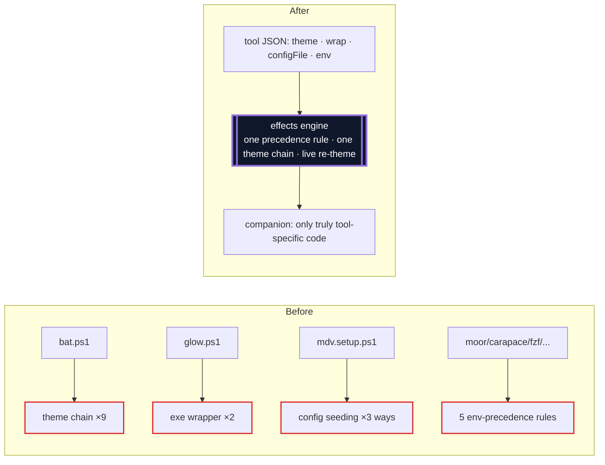
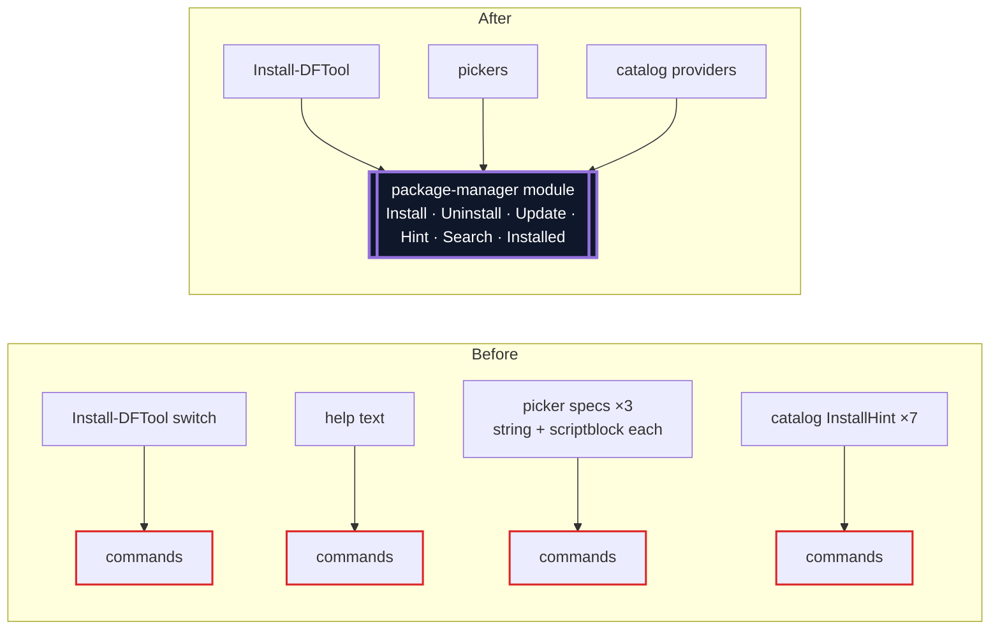
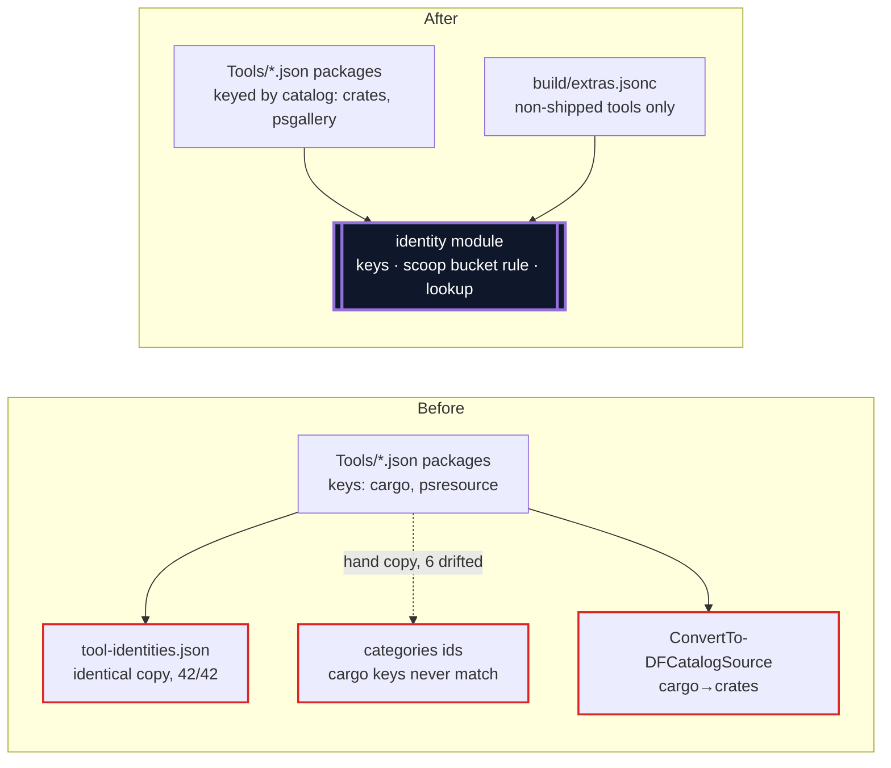

# DotForge Architecture Review (Claude)

**Date:** 2026-10-09 · **Scope:** the whole module, with backward compatibility out of scope (no users yet) · **Previous review:** 2026-10-06, in git history (`6d31800`). Its candidates #1–#7 and #9 were adopted (shrunk to a consistency test in #9's case); #8 was deferred and appears again here as candidate 5.

**Inputs:**
- Three read-only explorations: startup and composition, the tool plugin model, and catalog/data/install.
- Startup measured on this machine.
- Spot checks of every claim below.

**Glossary:** the terms *module*, *interface*, *depth*, *seam*, *adapter*, *leverage* and *locality* are used as defined in the codebase-design skill. No `CONTEXT.md` or ADRs exist yet, so domain terms come from `docs/plugin-architecture.md`: *tool record*, *companion*, *role*, *winner*, *catalog provider*.

## Measured startup (this machine, `pwsh -NoProfile`)

| Phase | Time | Notes |
|---|---|---|
| `Import-Module DotForge` | 0.76–1.05 s | dot-sources 86 files (60 Private, 26 Public, ~10,000 lines) |
| `Initialize-DFEnvironment` | ~0.31 s | includes a full tool-DB load and package-manager detection |
| `Import-DFToolDb` + role winners | ~0.3 s | 47 JSON files parsed and validated every start |
| availability checks | 0.35–0.64 s | `Get-Module -ListAvailable` per module tool |
| per-tool registration | 4–6 s* | posh-git 0.7–1.7 s, Terminal-Icons 0.6–0.9 s, PSFzf 0.4–0.6 s, starship/carapace/fnm 0.15–0.7 s each; the other 39 tools mostly under 100 ms |

\* Measured per tool without the background prewarm `Register-DFTool` starts. End to end, `Register-DFTool -All` measured about 2.3 s.

---

## 1. Two-phase activation: register what the prompt needs, defer the rest to idle

**Strength:** Strong · **Dependency category:** in-process
**Files:** `Public/Register-DFTool.ps1`, `Private/Register-DFToolSteps.ps1`, `Private/Start-DFModulePrewarm.ps1`, `Tools/{posh-git,Terminal-Icons,PSFzf,fnm,mise,oh-my-posh}.ps1`, `data/roles.json`

**Problem.** Every tool is activated before the first prompt. Three module imports (posh-git, Terminal-Icons, PSFzf) cost 1.7–3.2 s, and Terminal-Icons only matters the first time you list a directory. The prewarm ThreadJob adds a runspace and a second availability probe, and it only warms the OS file cache (`Start-DFModulePrewarm.ps1:145`, `Register-DFTool.ps1:112-114`).

**Solution.** A tool record declares *when* it activates: `"activation": "prompt"` (the default for roles marked as such in `roles.json`: prompt, tab-completion, project-env, navigation) or `"activation": "idle"`. The activation module runs phase 1 synchronously, then drains phase 2 from a `PowerShell.OnIdle` subscription, one tool per idle tick, still in `dependsOn` order. The prewarm job is deleted.

**Wins**
- **Time to first prompt:** expected to drop by most of the 2–3 s. The real number needs measuring.
- **Locality:** the timing policy lives in one module instead of in per-tool tricks.
- **Leverage:** any slow tool gets faster by changing one field.
- **Tests:** the phase split is a pure function of tool records, testable without real tools.

---

## 2. Split the startup core from the on-demand modules

**Strength:** Strong · **Dependency category:** in-process
**Files:** `DotForge.psm1`, `DotForge.psd1`, `Private/DFCatalog*.ps1` and ~25 catalog/identity/category files, `Public/{Find,Select}-DFPackage.ps1`, `Update-DF*.ps1`, `Get-DFCategoryList.ps1`, `Public/DFHelpers.*.ps1`, `Install-DFTool.ps1`, `New-DFShim.ps1`

**Problem.** Import costs 0.8–1 s, and about half of the code (the package catalog, the general helpers, install and shims) is never used while a shell starts. It loads eagerly anyway because provider registration, `$script:` state and argument completers all run at import time. Shared helpers sit in files named after something else (`Get-DFConfig` lives in `Get-DFConfiguredTheme.ps1`, `Get-DFXdgPath` in `ConvertTo-DFPath.ps1`). A build step could also bundle each module into a single `.psm1`, which loads much faster than 86 separate files.

**Solution.** Three PowerShell modules from one repo: **DotForge** (the startup core), **DotForge.Catalog** (trifle: catalogs, identity, categories, GitHub/readme enrichment) and **DotForge.Helpers** (general helpers, aliases). PowerShell's command auto-loading imports the other two on first use. A build script bundles each into one `.psm1` for publishing. Each module gets one file per concept.

**Wins**
- **Startup:** import should drop to only what registration touches. This needs measuring after the bundle step.
- **Locality:** catalog changes can't affect startup, and catalog tests load only the catalog.
- **Interface:** each module's export list becomes the honest interface; today one manifest lists everything.

---

## 3. One compiled tool registry instead of 47 files parsed and validated per start

**Strength:** Strong · **Dependency category:** local-substitutable (files)
**Files:** `Private/Import-DFToolDb.ps1`, `Private/Test-DFToolSchema.ps1`, `Initialize-DFEnvironment.ps1`, `Resolve-DFPackageManager.ps1`, `DotForge.psd1`, `docs/plugin-architecture.md`

**Problem.**
- **Repeated work every start:** reading, validating and normalizing 47 JSON files, which costs 100–130 ms plus 14 ms of schema checks.
- **A second pass during `Initialize-DFEnvironment`:** it detects package managers, which only `Install-DFTool` needs, and prints a status line.
- **Cross-tool indexes don't exist yet.** `docs/plugin-architecture.md` already says they should come from a build step: role membership, export lists, and the alias names that `Get-DFCommandConflict` re-parses from the manifest at runtime.

**Solution.** A build step compiles shipped tools into one normalized, pre-validated registry file holding the role index and the alias inventory. The runtime reads that one file, and runs validation only on user-supplied tool files. `Initialize-DFEnvironment` shrinks to exporting XDG variables, and package-manager detection moves into the install path. A test fails when the compiled registry is stale, like `Docs.Reference.Tests` does for the generated reference.

**Wins**
- **Startup:** about a 150–300 ms cut.
- **Locality:** validation and normalization happen once, at build time.
- **Leverage:** role and alias indexes come for free.
- **Tests:** they assert on the compiled registry, one file and one interface.

---

## 4. A declarative tool-effects engine: themes, wrappers, config files and env precedence move out of companions

**Strength:** Strong · **Dependency category:** in-process (plus local-substitutable files)
**Files:** `Tools/{bat,delta,fzf,glow,mdcat,mdv,moor,psreadline,vivid,fastfetch,carapace}.ps1` + `.json`, `Private/Get-DFConfiguredTheme.ps1`, `Resolve-DFThemeName.ps1`, `Set-DFToolXdgConfig.ps1`, `Register-DFToolSteps.ps1`, `Set-DFRoleEnv.ps1`

**Problem.** A companion author must learn scope rules, two global-function forms, captured `${function:}` scriptblocks and module `$script:` variables. The same idioms are copied across files:
- the theme chain, 9 times
- the exe wrapper with `ExpectingInput` piping, 2 times
- "deploy a bundled file if the bytes differ", 2 times
- validate against a name list, then warn and fall back, 3 times
- config seeding, 3 different ways

There are 11 ways a tool affects the session, with at least 5 env-precedence rules:
- `xdg.vars` keeps the user's value
- the `env` block overwrites it, so a `BAT_THEME` set in a profile is lost
- role env uses Defaults over user value over priority
- each companion picks its own rule
- two different write styles are used

Per-tool config keys (`BatTheme`, `MoorTheme`) exist only as string literals in code, so they can't be discovered or checked for typos. Most companion tests must run the full registration with real binaries, because nothing builds a valid `$DFCurrentTool`.

**Solution.** Add declarative fields the core applies with one set of rules:
- **`theme`:** `{ env | setting | file, map, names, default, configKey }`. One resolution chain and one live re-theme command for every tool, replacing the per-tool `Invoke-DFApply*Theme` functions and `$global:DFGlowStyle`.
- **`wrap`:** `{ args, configFlag }`, generating the exe wrapper.
- **`configFile`:** `{ path, seed: 'once' | 'always' | 'if-bytes-differ', source }`.
- **One env rule:** a tool default never overwrites a value the user set, while Defaults and roles still win over tool defaults.

Companions shrink to genuinely tool-specific code. Several (bat, moor, vivid, maybe delta) may disappear entirely. A `New-DFTestToolContext` helper builds the companion's input record for direct tests.

**Wins**
- **Locality:** theme, wrapper and env bugs get fixed once.
- **Leverage:** every new tool gets themes and wrappers by declaring them.
- **Config keys:** they become data, so the schema can validate `$DFConfig` keys and `Get-DFTool` can list them.
- **Tests:** they run through the engine with fake records instead of real binaries.
- **Size:** likely the largest code deletion in this review.

---

## 5. A package-manager module: one definition per manager for install, pickers, hints and search

**Strength:** Strong *(was deferred as #8; now carries live bugs)* · **Dependency category:** true external (package managers), so a port is justified, with two adapters: real and a recording fake
**Files:** `Public/Install-DFTool.ps1`, `Private/Resolve-DFPackageManager.ps1`, `Add-DFScoopBucket.ps1`, `Invoke-DFPackageManagerPicker.ps1`, `Tools/{scoop,winget,choco}.ps1`, `Private/DFCatalog.{Scoop,Winget,Choco,Npm,Pypi,Crates,PSGallery}.ps1`

**Problem.** Install commands live in 5 places, and they disagree:
- winget is called with `--silent` in one place and `--exact` in another
- the choco hint lacks `-y`
- pypi hints use pipx, but `packages` blocks have no pypi key

**Live bug:** `Install-DFTool` has no npm case, so `inshellisense` and `npm`, which declare only npm packages, can never be installed (verified).

Search and installed-listing are implemented twice, once in the picker specs and once in the catalog providers. Picker specs write a core `$script:` table directly. Install runs package managers inline with `$LASTEXITCODE` checks, behind no seam.

**Solution.** One record per package manager, held in a registry: install/uninstall/update/hint argv, bucket handling, search, installed, and availability. `Install-DFTool`, the pickers and the catalog providers all call it. It sits behind a port with a real adapter and a recording fake, so install logic is testable without running real package managers.

**Wins**
- **Fixes the npm bug** and the flag drift.
- **One place to add a manager.**
- **Install becomes testable** through the fake.
- **Removes duplicates:** the double search implementation and the `$script:` writes from companions go away.

---

## 6. One source of package identity, with one vocabulary

**Strength:** Strong · **Dependency category:** in-process (plus a build step)
**Files:** `data/tool-identities.json`, `build/Build-DFToolIdentities.ps1`, `build/categories/*.jsonc`, `Tools/*.json` (`packages`), `Private/DFCatalog.Base.ps1` (`ConvertTo-DFCatalogSource`, `Get-DFIdentityKeys`), `Public/Find-DFPackage.ps1:150`, `Resolve-DFCatalogQueryMerge.ps1`

**Problem.** Package ids exist in three copies:
- `Tools/*.json`.
- `data/tool-identities.json`, all 42 entries identical (verified). It adds only `linkedVia`/`repo`, and at runtime it's consulted after the Tools map anyway.
- A hand-written copy in `build/categories/dotforge-curated.jsonc`. It has drifted in 6 places: micro and wget lack choco, lsd and starship live in extras, and mdcat and mdv use `cargo` keys that the facet lookup never matches. That last one is a live bug.

Two names for the same catalog (manager vs catalog) need a translation function, which this session added as a stopgap. The scoop bucket-strip rule exists twice.

**Solution.** Key `packages` by **catalog** name. The package-manager module (candidate 5) maps a catalog to the manager that installs from it, which deletes `ConvertTo-DFCatalogSource`. The identity guide ships only what Tools/*.json can't say: non-shipped tools plus `repo`/`linkedVia`. Category data references tools by name and never copies ids. One identity module owns key rules and lookup.

**Wins**
- **Drift and the mdcat/mdv bug disappear by construction.**
- **One vocabulary:** the translation layer goes away.
- **Locality:** key rules live in one module.

---

## 7. The catalog cache owns its layout; providers become fetch + parse only

**Strength:** Worth exploring · **Dependency category:** remote but not owned (registries), so tests use recorded responses
**Files:** `Private/DFCatalog.ps1`, `DFCatalog.Base.ps1`, `DFCatalog.<Stem>.ps1` ×7, `Get-DFCatalogLocalPackages.ps1`, `Public/Update-DFPackageCache.ps1`, `Get-DFPackageReadme.ps1`, `Get-DFGitHubRepoInfo.ps1`, `Find-DFPackage.ps1`

**Problem.**
- **Registration by naming convention:** `Register-DFCatalogProvider` binds hooks by function name, so a misnamed hook fails only when it runs.
- **Thin providers:** each provider is five functions, two of them 3-line forwarders with help text, so the interface is nearly as large as the work.
- **Cache layout knowledge leaks:**
  - `Get-DFCatalogLocalPackages` hardcodes `scoop/index.json` and `winget/index.db`, and runs SQL against the index.
  - `Update-DFPackageCache` parses `seen-queries.json` and envelope files directly.
  - GitHub and readme enrichment ride the detail engine as "pseudo-providers", with a special case in the engine for them.
- **A hidden cross-provider dependency:** PSGallery uses an OData parser defined in the Choco provider's file.
- **Find-DFPackage assembles results itself:** it mutates `Details`, `Category` and `GitHub` instead of calling one enrichment step.

**Solution.**
- **Providers become data:** `{ Name, Kind, Fetch, FetchDetail, ListLocal, Ttl }` scriptblocks, registered explicitly.
- **The cache module owns everything else:** cache-first behavior, enumeration (for refresh), and local listing.
- **Enrichment becomes its own module:** GitHub info and readmes, called once per result.
- **Shared parsers move into shared files.**

**Wins**
- **About 14 forwarding functions deleted.**
- **The cache layout stays inside one module.**
- **Adding a catalog means writing fetch/parse only.**
- **Tests:** they feed recorded responses through one cache interface.

---

## 8. Build pipelines depend on a small, named build kit instead of all of `Private/`

**Strength:** Speculative (the package-universe pipeline is parked) · **Dependency category:** in-process
**Files:** `build/Build-DFToolIdentities.ps1:44`, `Build-DFPackageUniverseRaw.ps1:117`, `Build-DFPackageUniverseLinks.ps1:49`, `Test-DFToolConformance.ps1:39`

**Problem.** Four build scripts dot-source all of `Private/`, running the provider registration and module state along with it. They depend on private names such as `Build-DFCatalogScoopIndexData` and `ConvertFrom-DFCatalogODataEntry`. A rename silently breaks a pipeline that can take about 54 minutes to run.

**Solution.** After candidates 2 and 7, build scripts `Import-Module DotForge.Catalog` and use its exported interface, or a small `build/DFBuildKit.ps1` that re-exports exactly what they need. A test checks that every function a build script calls exists.

**Wins:** renames fail fast, and the build depends on an interface instead of internals.

---

## Smaller findings (not candidates)

- **Shared helpers hidden in other files:** `Get-DFConfig` sits in `Get-DFConfiguredTheme.ps1` and `Get-DFXdgPath` in `ConvertTo-DFPath.ps1`. They should be one file per concept (folds into candidate 2).
- **Repeated executable lookups:** companions repeat `Get-Command` lookups that `Test-DFToolAvailable` already cached (scoop, PSFzf, carapace, gsudo, choco, winget). `Get-DFCachedCommandOutput` resolves the executable again too. The registry could pass the resolved path to the companion.
- **Uncached process launches at every start:** `oh-my-posh init`, `mise activate`, and `fnm env` (which is per session, so it may not be cacheable).
- **Session globals with no lifecycle:** `$global:cdBeforeFnm`, `$global:DFGlowStyle`, `$global:DFDotenvLocationHook`, `$global:DFPSReadLineColors`.
- **Default-on diagnostic:** the coreutils conflict check runs every start and reads profile files. It could move to idle phase 2 (candidate 1).
- **Two unrelated category taxonomies:** `data/package-universe-categories.jsonc` and `tool-categories.json`. The package-universe files are build-only but ship in `data/`.
- **Fixed during this review:** PSFzf now depends on fzf, so fzf's `env` block can't wipe the `--ansi` that PSFzf's Tab hook adds (`b237124`).

## Top recommendation

**Start with candidate 4, the declarative tool-effects engine,** then do candidate 1.

- **Why 4 first:**
  - It's where most of the code and most of the confusion live: 9 copies of the theme chain, 5 env rules, 3 ways to seed config, and companions that can only be tested with real binaries.
  - It shrinks the interface every future tool has to learn.
  - It makes candidate 1 easier, since smaller, declarative companions are easier to defer and to reorder.
- **Why 1 right after:** it's the biggest user-visible win, seconds off every shell start, and it's mostly independent.
- **Bundled with 1:** the measurable parts of candidates 2 and 3 (the module split and the compiled registry), because they share the "measure before and after" work.
- **Next:** candidates 5 and 6 together. They fix two live bugs (npm installs; mdcat/mdv facet ids), and 5's catalog-to-manager mapping is what lets 6 delete the translation layer.
