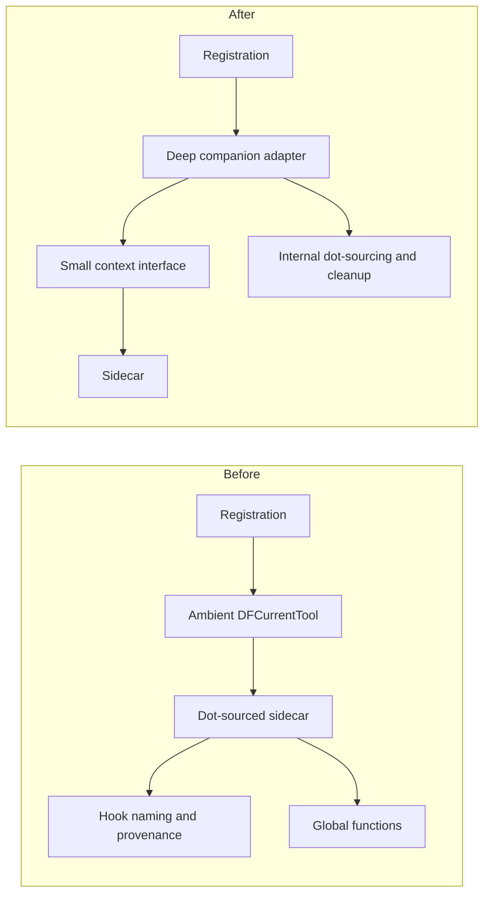
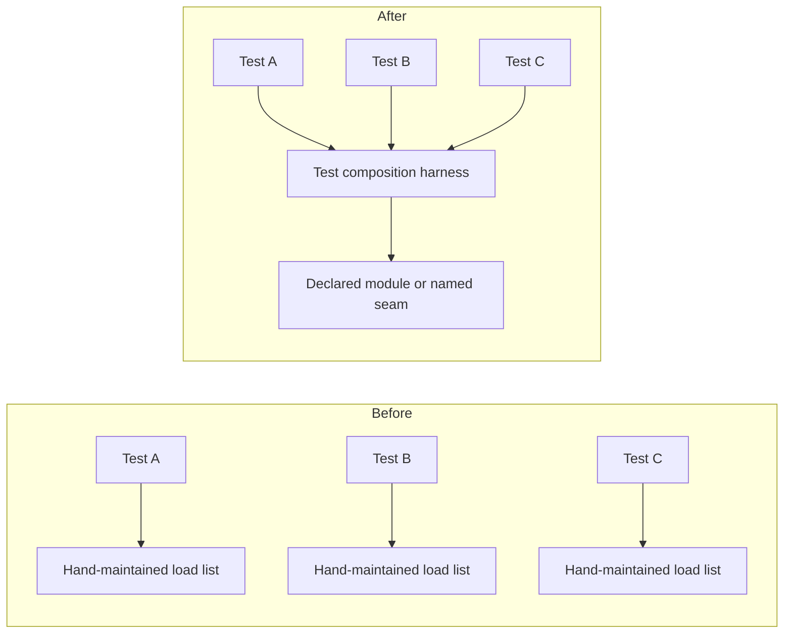

# DotForge Architecture Improvement Audit

**Date:** 2026-10-06  
**Scope:** Module composition, tool records and companions, catalog/provider seams, build metadata, and the Pester test harness. This is a read-only audit; no production behaviour was changed.

**Status (2026-10-08):** Triaged alongside `arch-imp-audit-(claude).md`, which covers all five of these candidates with more evidence. #1: shrunk (see that doc's #2). #2: adopted. #3: deferred until a third tool needs it. #4: adopted in a lighter form. #5: reduced to a consistency test.

## Assessment

DotForge has two effective deep modules: the declarative `Tools/<name>.json` registry with optional imperative companions, and the catalog-provider registry. The tool registration flow is also in better shape than an earlier audit: the public facade delegates the per-tool flow to `Private/Register-DFToolSteps.ps1`.

The most useful improvements now make existing implicit contracts explicit rather than replacing either registry with a generic framework. No `CONTEXT.md` or `docs/adr/` directory is present, so no candidate conflicts with a recorded ADR.

## What is already deep

- `ConvertTo-DFPath` concentrates path normalization behind one interface; callers do not need to reproduce Windows/XDG path rules.
- `ConvertTo-DFToolRecord` gives known generic record fields safe defaults while preserving tool-specific data (`Private/Import-DFToolDb.ps1:98-207`).
- `Invoke-DFToolRegistration` keeps role selection and normal registration order in one module (`Private/Register-DFToolSteps.ps1:202-255`).
- Catalog providers register through one real seam: seven adapters use `Register-DFCatalogProvider` rather than a source-name switch (`Private/DFCatalog.Base.ps1:15-75`; `Private/DFCatalog.*.ps1`).

## Candidates

### 1. Deepen the tool-companion seam with an explicit context adapter

**Recommendation strength:** Strong  
**Files:** `Private/Invoke-DFToolCompanion.ps1`, `Tools/*.ps1`, `tests/Invoke-DFToolCompanion.Tests.ps1`, `docs/external-dependencies.md`

**Problem.** The companion interface is shallow because an author must know dot-sourcing scope rules, `$DFCurrentTool`, filename conventions, hook names and signatures, function-provider provenance, cleanup behaviour, and a special hashtable that prevents a companion from clobbering host locals. The current module injects ambient state then dot-sources a companion (`Private/Invoke-DFToolCompanion.ps1:55-90`); setup uses the same protocol (`:93-123`). Tests must model that ambient contract directly (`tests/Invoke-DFToolCompanion.Tests.ps1:26-32`, `:46-88`).

**Possible improvement.** Retain compatible sidecars, but make a single companion adapter own invocation, context construction, hook discovery, error policy, and cleanup. Its explicit interface should pass only the record and the few registration operations a companion genuinely needs. Keep dot-sourcing inside the adapter only where PowerShell requires it; preserve global functions where their session lifetime is intentional.

**Why it has depth.** The deletion test is positive: deleting this module would re-spread scope, hook, and cleanup complexity among the many existing companions. Existing sidecars make this a real seam, not a hypothetical one. The adapter gives tests the same interface used in registration, improving locality; every future companion receives leverage from one well-tested implementation.

### 2. Deepen the Pester composition seam

**Recommendation strength:** Strong  
**Files:** `tests/*.Tests.ps1`, `tests/TestSupport.ps1`, `tests/ModuleState.Tests.ps1`

**Problem.** Tests contain 1,275 direct `Private/` or `Public/` dot-source statements across roughly 100 files. A representative registration test builds a 34-file load list before its assertions (`tests/XdgSplit.Tests.ps1:1-36`). The test suite itself records that individual dot-sourced files cannot reproduce the shared script scope of an imported module (`tests/ModuleState.Tests.ps1:2-4`). Thus every test author must understand module load order and internal dependencies before reaching the behavioural seam under test.

**Possible improvement.** Add a test-only composition module with a small interface: load the full module, or load a declared named seam with its dependencies; also centralize session-state cleanup. Retain a small set of true imported-module contract tests so the harness cannot conceal module-loading defects.

**Why it has depth.** The deletion test is positive: deleting repeated load lists concentrates their complexity in the harness. Tests gain locality because they state the seam they exercise, while a loader change has leverage across the suite.

### 3. Make uncooperative-XDG executable handling a declarative deep module

**Recommendation strength:** Worth exploring  
**Files:** `Tools/glow.json`, `Tools/glow.ps1`, `Tools/fastfetch.json`, `Tools/fastfetch.ps1`, `Private/Register-DFToolSteps.ps1`

**Problem.** `glow` and `fastfetch` both declare `xdg.method: wrapper` because the executable does not honor its XDG environment configuration. Their sidecar adapters repeat settings lookup, XDG expansion, parent-directory creation, managed/seed writes, global wrapper creation, and pipeline-forwarding details (`Tools/glow.ps1:20-28`, `:82-118`; `Tools/fastfetch.ps1:11-24`, `:51-55`). Two adapters demonstrate a real seam.

**Possible improvement.** Provide one declarative wrapper module: executable, normalized configuration path, fixed arguments, and seed policy in; config-path resolution, managed writes, global wrapper construction, and correct pipeline forwarding inside. Keep compact per-tool adapters only for genuinely specific work such as theme translation.

**Why it has depth.** The module hides the subtle `ExpectingInput` and XDG mechanics behind one interface. It improves locality for defects in executable wrapping and gives leverage when a third tool proves equally uncooperative.

### 4. Move optional tool-record validation into the decoder contract

**Recommendation strength:** Worth exploring  
**Files:** `Private/Import-DFToolDb.ps1`, `Private/Test-DFToolSchema.ps1`, `Tools/*.json`, `Tools/*.ps1`

**Problem.** The decoder normalizes aliases, roles, XDG, and picker shapes while preserving unknown fields (`Private/Import-DFToolDb.ps1:98-207`), but the schema validates only a subset of optional structure (`Private/Test-DFToolSchema.ps1:49-98`). An invalid optional value can therefore cross the registry seam and fail only in registration or a sidecar. The free-form `settings` maps are intentionally tool-specific: `psreadline`, `glow`, and `fastfetch` already consume different shapes.

**Possible improvement.** Define a versioned ToolRecord decoder module whose interface validates and normalizes every generic optional field at import time, with an explicit extension field for per-tool settings. Do not force those settings into a common adapter until two settings shapes truly vary in the same way.

**Why it has depth.** The interface becomes one author-facing failure point instead of a permissive JSON protocol plus distributed runtime checks. That improves test locality and gives all record consumers leverage without turning unrelated settings into a hypothetical seam.

### 5. Consolidate public-surface metadata only when documented generation work lands

**Recommendation strength:** Speculative  
**Files:** `DotForge.psd1`, `DotForge.psm1`, `build/Build-DFReferenceDocs.ps1`, `docs/plugin-architecture.md`

**Problem.** Public-surface facts currently appear in three places: manifest exports (`DotForge.psd1:11-78`), the implicit `Public/` loader (`DotForge.psm1:7-9`), and the public-file-to-reference-section table (`build/Build-DFReferenceDocs.ps1:33-51`). An unknown public file falls back to the `Core` documentation section (`:184-198`).

**Possible improvement.** When the planned manifest-generation work described in `docs/plugin-architecture.md:66-90` is ready, use one declarative source for export and reference-doc grouping metadata. Do not use it to auto-export runtime tool aliases: their separate ownership is deliberate (`docs/external-dependencies.md:216-224`).

**Why it is speculative.** The deletion test is positive only if this replaces, rather than adds to, all three representations. The existing loader is tiny and the documentation generation is already deterministic, so this should follow rather than precede more concrete seams above.

## Recommended sequence

1. Establish the companion adapter contract and migrate one simple sidecar as a compatibility test.
2. Introduce the test composition harness alongside existing tests; convert the most duplicated registration suites first.
3. Extract the XDG-wrapper module only after the companion adapter gives it a natural home.
4. Tighten the generic ToolRecord decoder and schema with negative tests.
5. Revisit public-surface metadata when the documented generation effort is active.

## Validation performed

- Inspected module load/export composition, the registration steps, tool record decoding/schema, companion execution, catalog provider registration, build metadata, documentation, and representative Pester suites.
- Compared candidates with existing seams and the deletion test; no tests were run because this audit changes documentation only.
